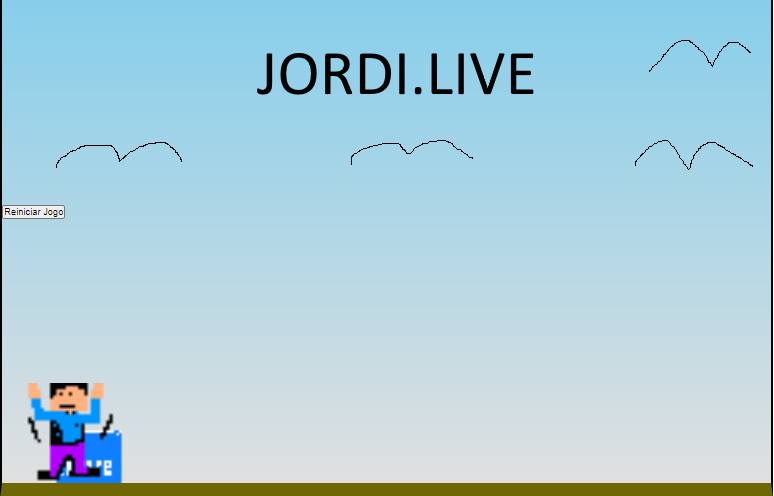

# 🎮 Jogo: Jordi Live

## 📝 Descrição
Este é um jogo simples desenvolvido em **HTML**, **CSS** e **JavaScript**, onde o jogador controla o personagem "Jordi" para desviar de obstáculos. O objetivo é evitar colisões enquanto acumula pontos.

## 🌟 Funcionalidades
- ✨ Personagem que realiza saltos ao pressionar uma tecla.
- 🏃‍♂️ Obstáculo em movimento contínuo.
- ⚠️ Detecção de colisão.
- ❌ Tela de game over quando o jogador colide com o obstáculo.

## 🛠️ Tecnologias Utilizadas
- 🖥️ **HTML5**: Estrutura da página.
- 🎨 **CSS3**: Estilização e animações.
- 🧠 **JavaScript**: Lógica do jogo.

## 🎮 Como Jogar
1. 📂 Abra o arquivo `index.html` em um navegador.
2. ⌨️ Pressione qualquer tecla para fazer o personagem "Jordi" pular.
3. 🚀 Desvie do obstáculo para continuar jogando.
4. 💥 Se o personagem colidir com o obstáculo, o jogo será encerrado.

## 📂 Estrutura do Projeto
```
JordiLiveGame/
├── index.html      # Estrutura do jogo
├── style.css       # Estilos e animações do jogo
├── script.js       # Lógica do jogo
├── images/         # Imagens utilizadas no jogo
└── README.md       # Documentação do projeto
```

## 📜 Código Principal
### 🖋️ JavaScript (`script.js`)
```javascript
const jordi = document.querySelector('.jordi');
const box = document.querySelector('.box');

const jump = () => {
    jordi.classList.add('jump');
    setTimeout(() => {
        jordi.classList.remove('jump');
    }, 500);
}

const loop = setInterval(()=> {
    const boxPosition = box.offsetLeft;
    const jordiPosition = +window.getComputedStyle(jordi).bottom.replace('px', '');

    console.log(jordiPosition);

    if (boxPosition <= 100 && boxPosition > 0 && jordiPosition <60) {
        box.style.animation = 'none';
        box.style.left = `${boxPosition}px`;  
        
        jordi.style.animation = 'none';
        jordi.style.bottom = `${jordiPosition}px`; 

        jordi.src = './images/over.png';

        clearInterval(loop);
    }

}, 10);

document.addEventListener('keydown', jump);
```

### 🎨 CSS (`style.css`)
```css
*{
    margin: 0;
    padding: 0;
    box-sizing: border-box;
}

.game-board{
    width: 50%;
    height: 500px;
    border: 2px solid black;
    border-bottom: 15px solid rgb(110, 103, 4);
    margin: 0 auto;
    position: relative;
    overflow: hidden;
    background: linear-gradient(#87CEEB,#e0e0e0) ;
}

.box {
    position: absolute;
    bottom: 0;
    width: 80px;
    animation: box-animation 2s infinite linear;
}

.jordi {
    width: 100px;
    position: absolute;
    bottom: 0px;
    left: 20px
}

.jump {
    animation: jump 600ms ease-out;
}

@keyframes box-animation {
    from {
        right: -80px;
    }
    to {
        right: 100%;
    }
}

@keyframes jump {
    0% {
        bottom: 0;
    }
    40% {
        bottom: 165px;
    }
    50% {
        bottom: 165px;
    }
    60% {
        bottom: 165px;
    }
    100% {
        bottom: 0;
    }
}
```

## 🖼️ Imagem do Jogo


## 🚀 Melhorias Futuras
- ➕ Adicionar sistema de pontuação.
- 📈 Incrementar níveis de dificuldade.
- 🛑 Implementar uma tela inicial e opções de reinício.

## 👤 Autor
- **Jordi** - [Jordi Branger](de-jordi.github.io/lab)

---
🎉 Divirta-se jogando e compartilhe suas sugestões!
